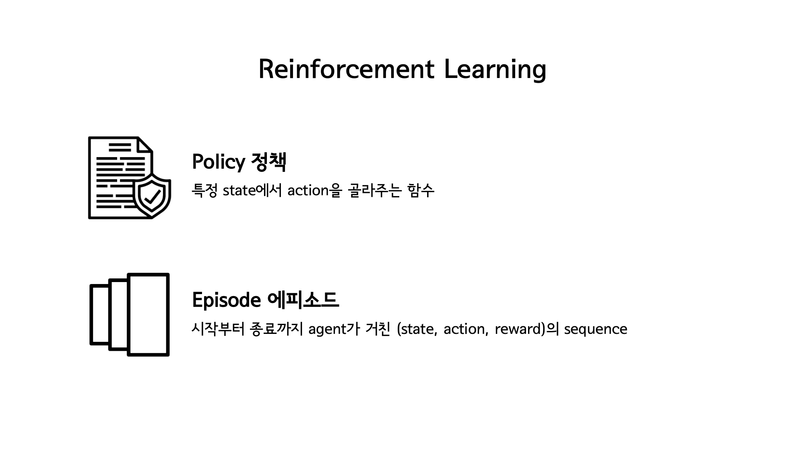
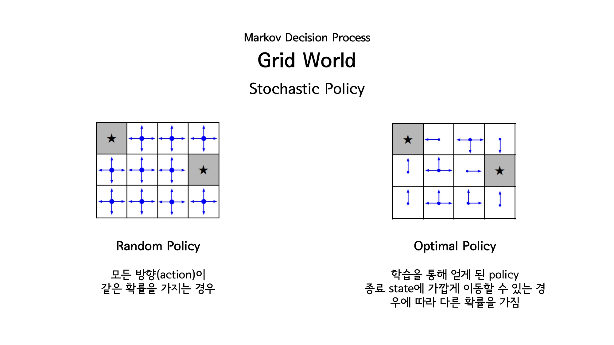
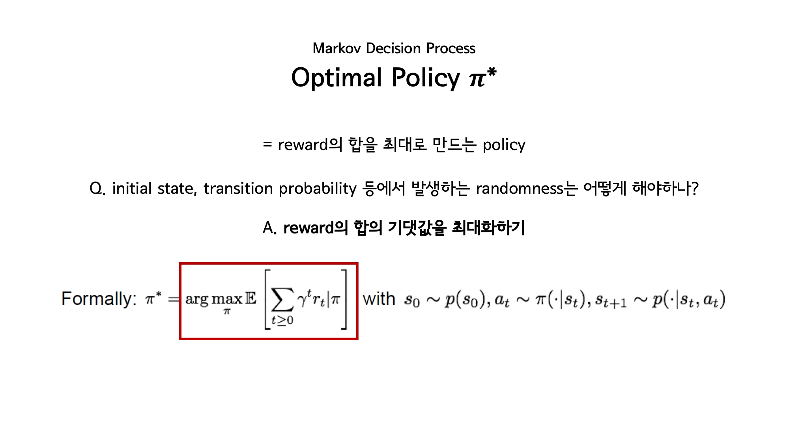
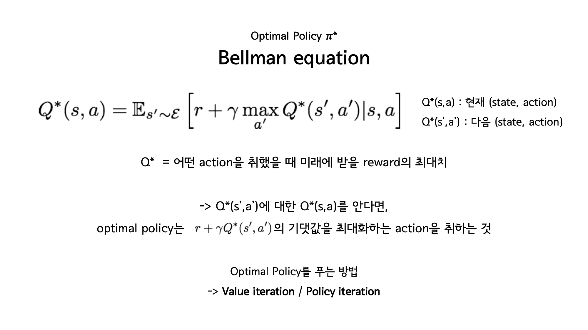
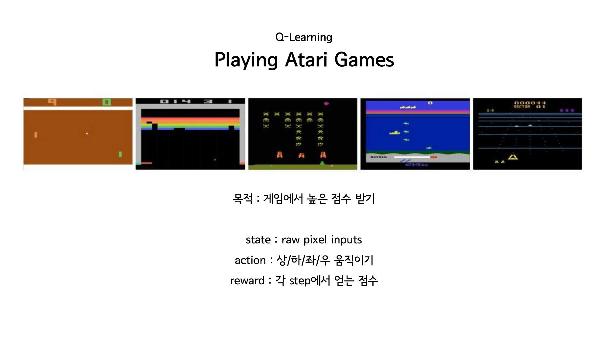
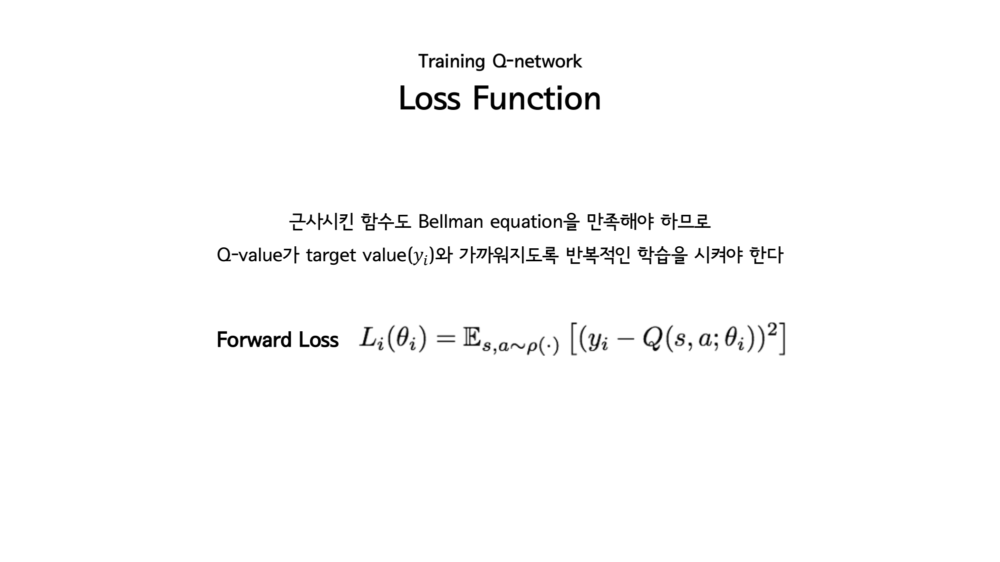
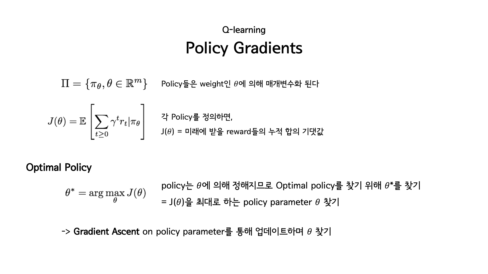
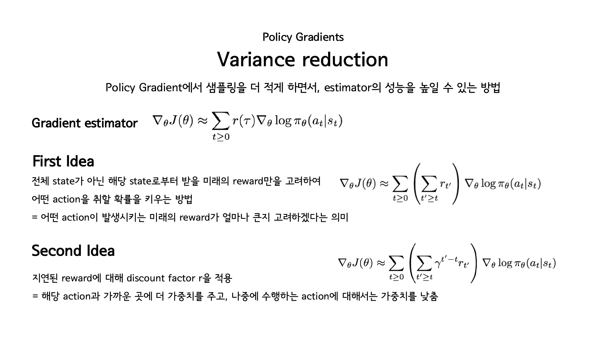

# \[Lecture 14\] Deep Reinforcement Learning

## CS231n 14강 리뷰

## Reinforcement Learning \(강화학습\)

Reinforcement Learning에는 몇 가지 중요한 용어들이 있다.

state\(상태\)는 agent가 action을 선택하기 위해 받는 정보를 의미한다. 각각 agent\(주체\)는 environment에서 action을 취하는 주체이며, action은 agent가 특성 state에서 취할 수 있는 행동을 말한다. 각 agent가 action을 취하면 reward\(보상\)을 받게 된다. 이 모든 것들이 일어나는 배경을 environment\(환경\)이라고 한다. 

agent가 특정 state에서 어떤 action을 취할지 골라주는 함수를 policy\(정책\)이라고 하며, 시작부터 종료까지 agent가 거친 일련의 \(state, action, reward\)들을 episode라고 한다.

즉, Reinforcement Learning\(강화학습\)은 agent가 최대 reward를 받을 수 있는 action을 취하도록 학습시키는 것을 목적으로 한다. 이는 달리 말하면 최적의 정책 함수\(policy\)를 찾는 것과 같은 의미이다.

강화학습의 과정은 다음과 같다.

\(추가해야함\)

강화학습의 예시이다.

## Markov Decision Process \(MDP\)

Markov Decision Process\(MDP\)는 강화학습 문제를 수식화한 것이다.



