# \[Lecture 14\] Deep Reinforcement Learning

## CS231n 14강 리뷰

14강은 강화학습에 대해 알아본다.

## Reinforcement Learning \(강화학습\)

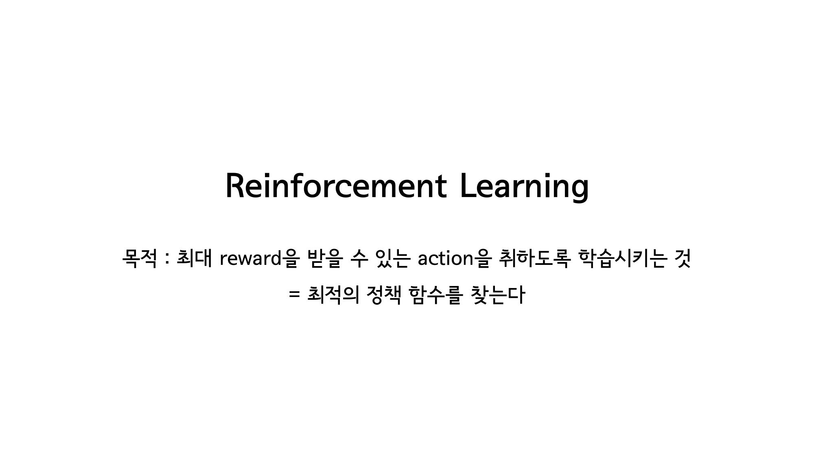

**Reinforcement Learning\(강화학습\)**은 **agent**가 최대 **reward**를 받을 수 있는 **action**을 취하도록 학습 시키는 것을 목적으로 한다. 이는 달리 말하면 최적의 **정책 함수\(policy\)**를 찾는 것과 같은 의미이다.

강화학습을 설명하기 위해 필요한 중요한 용어들이 있다.

**state\(상태\)**는 agent가 action을 선택하기 위해 받는 정보를 의미한다. 각 **agent\(주체\)**는 environment에서 action을 취하는 주체이며, **action**은 agent가 특성 state에서 취할 수 있는 행동을 말한다. 각 agent가 action을 취하면 reward\(보상\)을 받게 된다. 이 모든 것들이 일어나는 배경을 **environment\(환경\)**이라고 한다. 

agent가 특정 state에서 어떤 action을 취할지 골라주는 함수를 **policy\(정책\)**이라고 하며, 시작부터 종료까지 agent가 거친 일련의 \(state, action, reward\) 시퀀스를 **episode\(에피소드\)**라고 한다.

environment는 agent의 action에 따라 reward를 제공하고, 다음 state를 부여한다.

위 과정은 종료 상태가 될 때까지 즉, 하나의 에피소드가 끝날 때까지 반복된다.

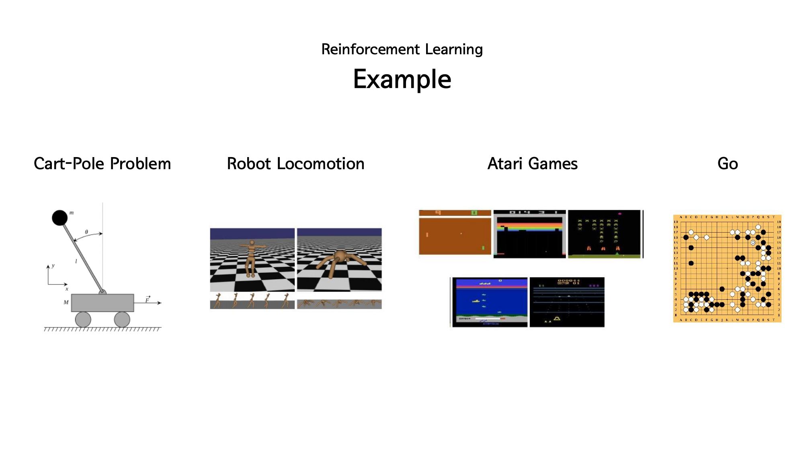

다음은 강화학습의 예시이다.

각각 막대기를 세우거나, 로봇을 움직이거나, 높은 점수를 받거나, 게임에서 이기는 등의 목적을 갖고 있는 강화학습이다.

## Markov Decision Process \(MDP\)

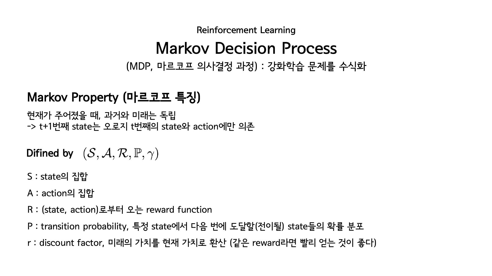

**Markov Decision Process\(MDP\)**는 강화학습 문제를 수식화한 것다. 

**Markov Property**는 현재가 주어졌을 때,  과거와 미래는 독립인 t+1번째 state는 오로지 t번째의 state에만 의존하는 것을 의미한다. MDP는 Markov Property를 만족하고, 이는 \(S, A, R, P, r\)로 정의한다.

이 중 **P**는 **transition probability**로 특정 state에서 다음 번에 도달할 state들의 확률 분포를 의미한다.  
**r**은 **discount factor**로 미래의 가치를 현재 가치로 환산하는 것이다. 이는 같은 reward라면 빨리 얻는 것이 좋다는 것을 내포하고 있다.

위에서 본 강화학습 과정을 MDP를 통해 표현하면 다음과 같다.

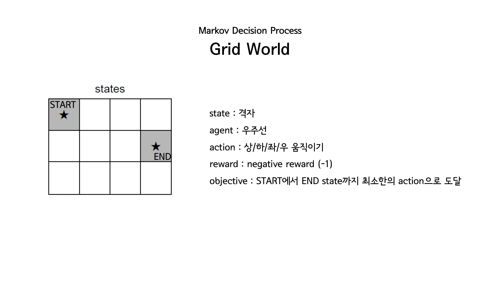

간단한 MDP의 예시로 Grid World가 있다.  
Grid World는 시작 지점에서 끝 지점까지 최소한의 움직임으로 도달하는 것을 목표로 한다. 

Stochastic Policy는 ****2가지로 나눌 수 있다. **Random Policy**는 모든 action이 같은 확률을 가지는 경우이다. Optimal Policy 학습을 통해 얻은 정책으로, 얼마나 종료 지점에 가깝에 이동할 수 있는지에 따라 다른 확률을 가진다.

### Optimal Policy pi\*

MDP를 정의하면 **최적의 정책 pi\***을 찾아야 하는데, 이는 reward의 합을 최대로 만드는 정책을 의미한다.

실제 초기 상태를 샘플링할 때, 전이 확률 분포 등에서는 다음 상태가 확률적이다. 이러한 randomness를 다루기 위해서 **reward의 합의 기댓값을 최대화**하여 최적의 정책 pi\*를 계산하게 된다.

### Value Function & Q-value Function

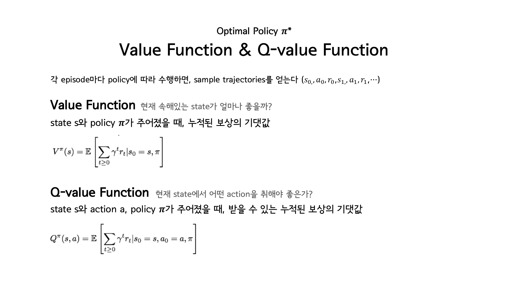

최적의 정책을 찾기 위해 사용되는 몇 가지 정의가 존재한다. 정책에 따라 각 에피소드를 수행하면, \(_s0, a0, r0, s1, a1, r1, ..._\)와 같은 경로를 얻게 되는데, 이를 사용하여 정의한다.

**Value Function**은 _'현재 속해있는 상태가 얼마나 좋은가?'_ 에 대한 값을 나타내는 것으로, **상태 s**와 **정책 pi**가 주어졌을 때, **누적된 보상의 기댓값**을 의미한다. 

Q-value Function은 _'현재 속해있는 상태에서 어떤 행동을 취해야 좋은가?'_ 를 의미한다. 이는 **상태 s**와 **정책 pi** 그리고 **행동 a**가 주어졌을 때 받을 수 있는 **누적된 보상의 기댓값**이다. 

최적의 정책 pi\*로부터 나온 최적의 정책 함수 **Q-value Function Q\***는 **Bellman equation**\(벨만 방정식\)을 만족한다. 즉, 벨만 방정식은 최적의 정책 함수를 찾는 가장 기본적인 방법이다.

따라서 벨만 방정식을 따르는 최적의 정책 함수 수식은 위와 같다.

**Q\***는 **어떤 행동을 취했을 때 미래에 받을 보상의 최대치**를 의미한다. 

다음 **Q\*\(state, action\)**를 구할 때, 현재 Q\*\(state, action\)를 안다면 이를 통해서 다음 상태에서 최상의 행동을 취할 수 있는 최적의 정책을 구할 수 있다. 여기서 말하는 **최적의 정책은 r+rQ\*\(s',a'\)의 기댓값을 최대화하는 행동을 취하는 것**이다.

벨만 방정식을 만족하는 최적의 정책을 푸는 방법에는 **Value Iteration**과 **Policy Iteration**이 있다. 

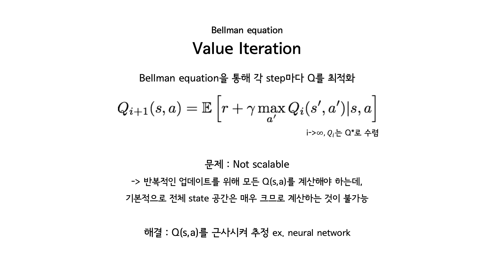

**Value Iteration**은 **벨만 방정식을 사용해 각 step마다 Q를 조금씩 최적화**하는 방법이다. 따라서 i가 무한대라면 최적의 정책 함수인 Q\*로 수렴하게 된다.

이를 구하는 과정에서 반복적인 업데이트를 위해 모든 Q\(s,a\)를 계산해야 한다. 기본적으로 전체 상태 공간은 매우 커서 계산하는 것이 사실상 불가능하기 때문에, neural network 등의 방법으로 Q\(s,a\)를 근사시켜 추정하게 된다.

앞서 말했듯이 **action-value function 추정을 위해 함수를 근사**시키게 되는데, 이 과정에서 deep neural network를 사용하고, 이를 **deep Q-Learning**이라고 한다.

Q-function은 벨만 방정식을 따르기 때문에, 식은 위와 같고 학습은 아래와 같이 진행된다.

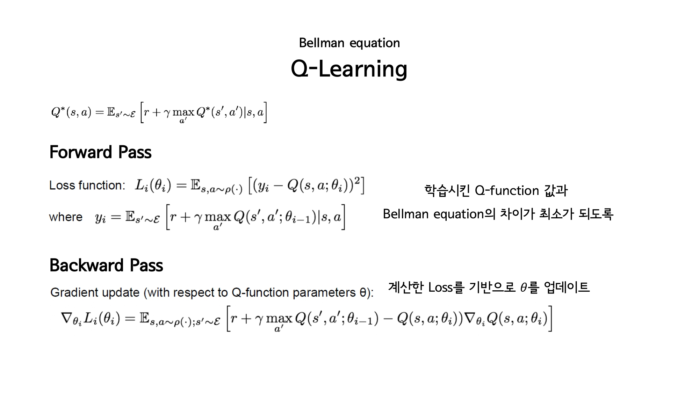

**Foward Pass**의 loss 함수 Q-function 값과 벨만 방정식의 차이이다. 실제 학습 시 loss가 작아지도록, **두 차이가 최소가 되도록** 학습을 진행한다. 이 과정을 반복하며 Q가 Q\*에 가까워지게 학습 시킨다.

**Backward Pass**는 **계산한 loss**를 바탕으로 파라미터인 **theta 업데이트**를 진행한다.

Q-Learning의 예시로 유명한 Atari 게임이다. 해당 게임은 상하좌우로 움직여 높은 점수를 받는 것을 목적으로 한다. 

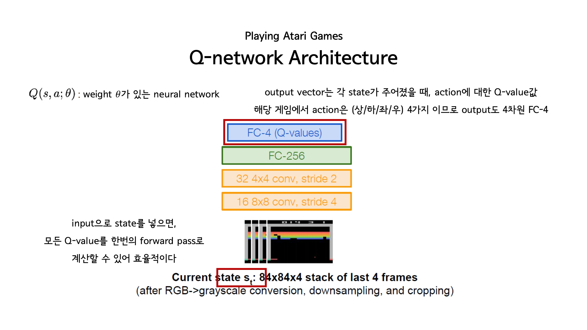

Atari 게임의 Q-network Architecture는 위와 같다. 이는 Q\(s,a;theta\)로 weight theta가 있는 neural network이다.

해당 모델의 input은 4개씩 쌓아둔 **상태\(s\_t\)** 프레임이다. input으로 state를 넣으면 모든 Q-value를 한번의 forward pass로 계산할 수 있어 효율적인 구현이 가능하다. 

이후 2개의 convolution layer와 2개의 FC layer를 거친다. 마지막 FC layer는 게임에서의 행동이 상/하/좌/우 4가지이므로 4차원인 FC-4를 사용한다. 즉, **output vector**는 **각 상태가 주어졌을 때, 각 행동에 대한 Q-value값**을 의미한다.

위에서도 짧게 언급했지만, 근사시킨 함수도 벨만 방정식을 만족해야 하기 때문에 **Q-value가 target value\(y\_i\)와 가까워지도록 반복적인 학습**을 시킬 필요가 있다.

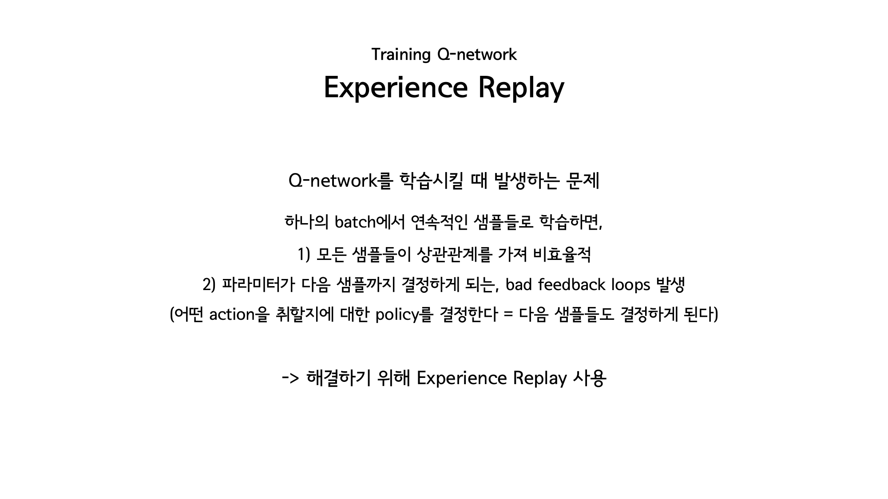

Q-network를 학습시킬 때 발생할 수 있는 문제가 몇 가지 존재한다.

하나의 batch 내에서 연속적인 샘플들로 학습을 진행하면, 모든 샘플들이 **상관관계**를 가지게 되어 비효율적이다. 또한, 파라미터가 다음 샘플까지 결정하는 **bad feedback loops**도 발생하게 된다. 여기서 말하는 다음 샘플을 결정하다는 건, 어떤 행동을 취할지에 대한 정책을 결정한다와 같은 의미이다.

따라서 이와 같은 문제를 해결하기 위해 **Experience Replay**를 사용한다.

Experience Replay는 **Replay Memory**를 이용하는 방법이다. **Replay Memory**는 \(_s\_t, a\_t, r\_t, s\_t+1_\)로 구성된 **transition table**\(전이 테이블\)이다. 이는 에피소드를 진행하며 지속적으로 **업데이트** 된다. 

이를 사용해서 Q-network를 학습시키면, 연속적인 샘플들을 대신하여 Replay Memory에서 **랜덤하게 샘플링된 미니배치**를 사용하여 상관관계 문제를 해결할 수 있다. 그리고 하나의 샘플이 여러 번 뽑혀 **multiple weight update**가 가능해 데이터의 효율 또한 증가하게 된다.

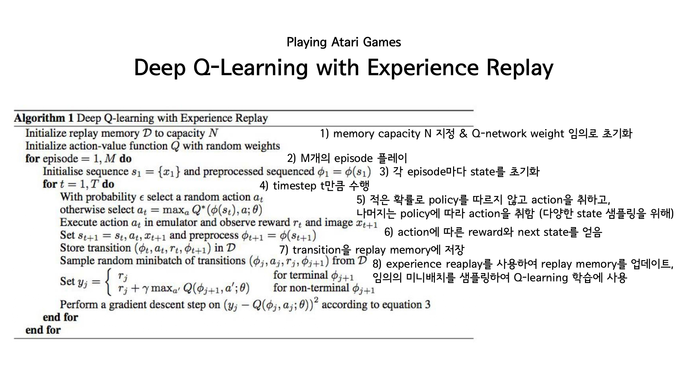

실제 Experience Replay를 사용한 Deep Q-Learning의 학습 과정은 다음과 같다.

1\) replay memory capacity인 N을 정하고, Q-network weight를 임의로 초기화한다.  
2\) 총 M개의 에피소드를 진행한다.  
3\) 각 에피소드마다 상태를 초기화한다.  
4\) timestep t만큼 학습을 수행한다.  
5\) 대부분 정책에 따라 행동을 취하고, 일부는 정책을 따르지 않고 임의로 행동을 취한다. \(이는 다양한 상태 샘플링을 얻기 위해서 이다.\)  
6\) 행동에 따른 보상과 다음 상태를 얻는다.  
7\) transition을 replay memory에 저장한다.  
8\) experience replay를 통해 replay memory를 업데이트하고, 임의의 미니배치를 샘플링하여 Q-learning 학습에 사용한다.  
에피소드의 M을 각각의 timestep t만큼 4~8을 반복하여 진행한다.

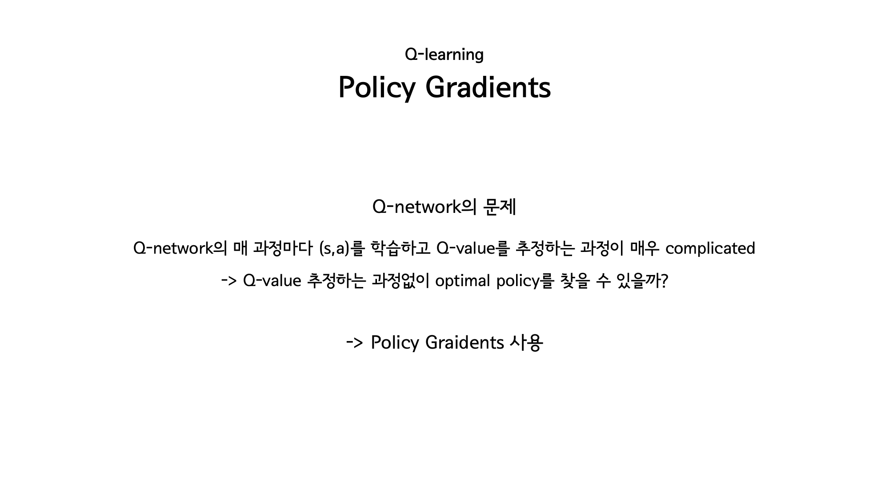

Experienced Replay로 상관관계 문제를 해결하고, 데이터의 효율을 높였지만 여전히 Q-network의 문제는 존재한다. Q-network의 매 과정마다 \(s,a\)를 학습하고 Q-value를 추정하는 과정은 매우 **complicated**하다. 이를 해결하기 위해 Q-value를 추정하는 과정없이 최적의 정책을 찾을 수 있는 방법을 고안해냈다.

이가 바로 **Policy Gradients**이다.

Q-learning에서 정책들은 weight인 theta에 의해 **매개변수화** 된다. 그리고 각각의 정책을 정의하면, 미래에 받을 보상들의 누적 합의 기댓값 **J\(theta\)**로 표현할 수 있다. 

이 두 내용을 이용하면, 정책은 theta에 의해 정해지므로 **최적의 정책을 찾기 위해 최적의 theta\*를 찾으면 된다**는 **Policy Gradients**가 정의된다. 기존처럼 매 과정마다 \(s,a\)를 학습하는 것이 아니라 **Gradient Ascent on policy parameter**를 통해 업데이트하며 최적의 theta를 찾아나가는 방식으로 학습을 진행하게 된다.

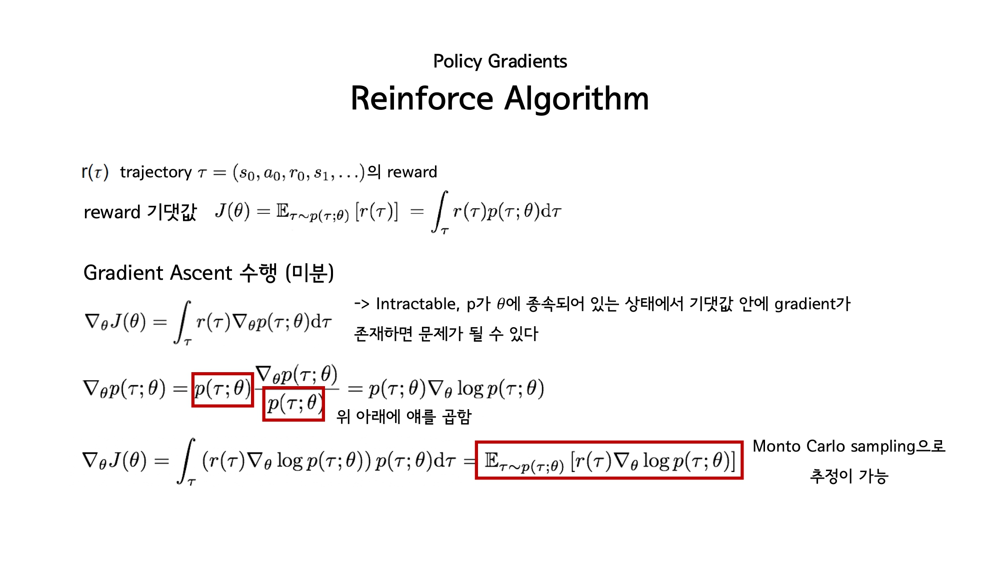

Policy Gradients를 사용한 강화학습 알고리즘은 에피소드에 대한 경로 r\(r\)이 주어졌을 때, 이의 보상에 대한 기댓값 J\(theta\)를 정의한다. 이 식은 위와 같다.

theta의 업데이트를 위해 Gradient Ascent를 수행한다. 기존 J\(theta\)는 Intractable, p가 theta에 종속되어 있는 상태에서 기댓값 안에 gradient가 존재하는 문제가 존재한다. 이를 해결하기 위해 위 아래에 p\(r;theta\)를 곱해 맨 아래와 같은 식을 도출했고, 이는 Monto Carlo sampling으로 추정이 가능하다.

어떤 경로에 대한 확률이 p\(r;theta\)일 때, log를 씌운 값을 미분하면 첫 항은 transition probability와 무관한 값을 가지므로 사라지게 된다. 이 말은 gradient를 계산하기 데에 transition probability가 필요하지 않다는 것을 의미하기도 한다.

따라서, 경로 r을 샘플링할 때, J\(theta\)를 추정할 수 있게 된다. 즉, 최적의 정책을 정하는 최적의 theta를 찾게 되는 것이다.

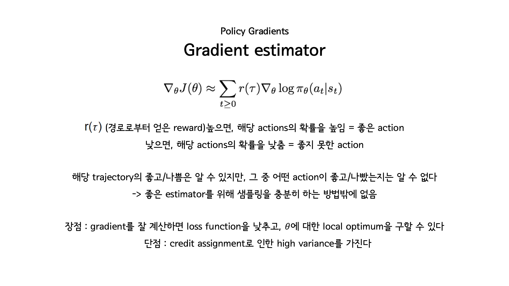

위 J\(theta\)를 추정한 식은 경로로부터 얻은 보상인 **r\(t\)가 높으면, 해당 행동의 확률을 높이고**, 해당 행동은 좋은 행동이라는 의미를 갖는다. 반대로 **낮으면, 해당 행동이 좋지 못한 것**이므로 확률을 낮추게 된다.

단, 이를 다 계산하고 나면 해당 **경로에 대한 좋고/나쁨은 알 수 있지만, 경로 내에서 어떤 행동이 좋고 나빴는지는 알 수가 없다.** 따라서 좋은 estimator를 위해서는 **샘플링을 충분히 하는 것**이 최선의 방법이다.

Policy Gradients는 gradient 계산이 잘 되면 loss를 낮추고, theta에 대한 local minimum을 구할 수 있다. 하지만 credit assignment로 인해 **high variance**를 갖게 된다.

**Variance reduction**은 Policy Gradient에서 아주 중요한 분야이다. 이는 샘플링을 더 적게 하면서 estimator의 성능을 높일 수 있는 방법이다.

첫 번째 아이디어는 전체 상태가 아닌 **현재 상태로부터 받을 미래의 보상만을 고려하여 어떤 행동을 취할 확률을 키우는 방법**이다. 다른 말로, 어떤 행동이 발생시키는 미래의 보상이 얼마나 큰지를 고려한다는 뜻이다.

두 번째 아이디어는 **지연된 보상\(시간이 경과한 보상\)에 대해 discount factor r을 적용**하는 방법이다. 이는 해당 상태과 가까운 행에 더 가중치를 주고, 나중에 수행하는 행동에 대해서는 가중치를 낮춘다.

앞서 말한 내용들을 정리하자면, Policy Gradients는 경로에서부터 계산한 값을 그대로 사용하는데, 이보다는 **실제로 받은 보상이 예상보다 좋은지 아닌지를 판단**하는 것이 더 중요하다.

그래서 **Baseline**을 사용한다. Baseline은 말그대로 해당 상태에서 **우리가 얼만큼의 보상을 원하는지에 대한 기준**이다. 식을 보면 알 수 있듯이, 미래에 얻을 보상의 합을 baseline에서 빼주는 형태로 사용된다.

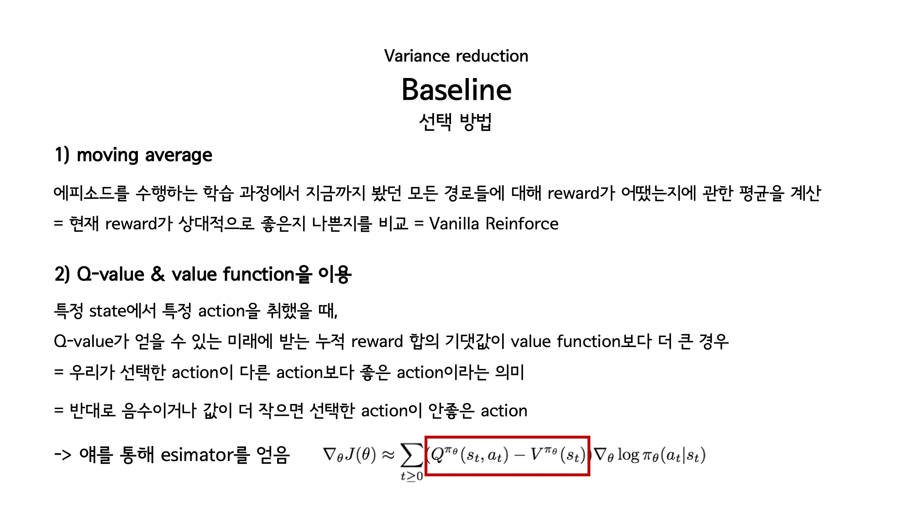

Baseline은 말그대로 기준점이기 때문에 선택할 수 있는 방법이 크게 두 가지가 있다.

먼저, **moving average** 방식으로 에피소드를 수행하는 학습 과정에서 지금까지 거쳐온 **모든 경로들에 대한 보상의 평균**을 계산하는 방식이다. 이는 현재 보상이 다른 것들에 비해 상대적으로 좋은지 나쁜지를 비교하는 기준점으로 **Vanilla Reinforce** 방식이라고도 불린다.

또 다른 방식은 앞서 계산했었던 **Q-value function과 Value function을 이용**하는 것이다. 특정 상태에서 특정 행동을 취했을 때, **Q-value가 얻을 수 있는 미래에 받을 누적 보상 합의 기댓값이 value function보다 큰 경우는 우리가 선택한 행동이 다른 행동보다 좋다**는 의미로 여겨진다. 반대로 음수이거나 더 작으면 선택한 행동이 별로 좋지 않다는 것이다. 얘를 통해서 estimator를 얻는다. 

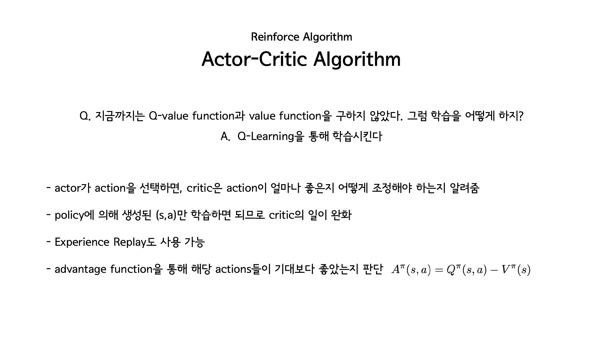

지금까지 Q-value function과 Value function을 구하지 않았는데, 이를 구하지 않고도 Q-Learning을 통해 학습이 가능하다.

**Actor-Critic 알고리즘**은 actor가 행동을 선택하면, critic은 해당 행동이 얼마나 좋은지 어떻게 조정해야 하는지 알려준다. 즉, actor는 정책, critic은 Q-function을 의미한다. 이 때 policy에 의해 생성된 \(s,a\)만 학습하면 되므로 critic의 일이 완화된다. 또한 Experience Replay도 사용이 가능하고, advantage function을 통해 해당 행동이 기대보다 좋았는지 판단도 할 수 있다.

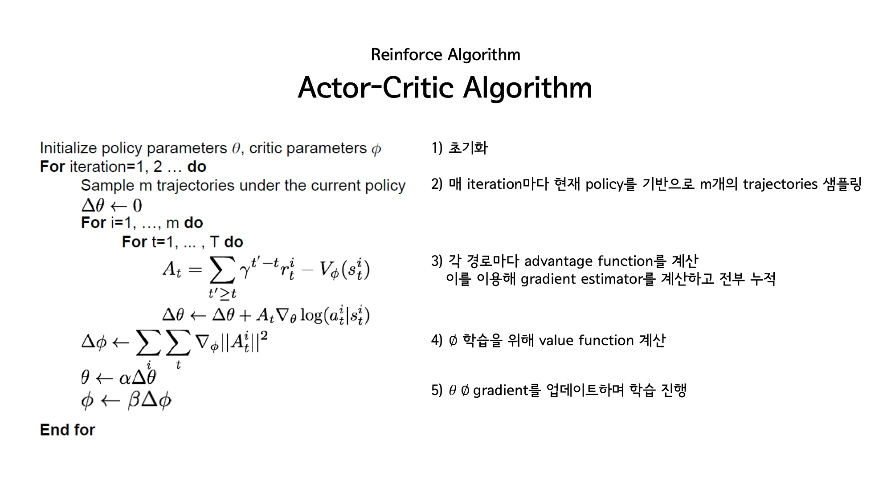

실제 Actor-Critic 알고리즘의 진행 과정은 다음과 같다.

1\) 정책 파라미터 theta와 critic 파라미터 pi를 모두 초기화 시킨다.  
2\) 매 iteration마다 현재 정책을 기반으로 m개의 경로를 샘플링한다.  
3\) 각 경로마다 advantage function을 계산하고, 이를 이용해 gradient estimator를 계산하고 전부 누적 시킨다.  
4\) pi 학습을 위해 value function을 계산한다.  
5\) theta와 pi gradient를 업데이트하며 학습을 계속 진행한다.

**Recurrent Attention Model\(RAM\)**은 Image Classification을 위해 Policy gradient를 이용한 Hard Attention Model이다. 이 모델 일련의 이미지의 일부인 glimpses만을 가지고 이미지를 분류한다.

glimpses를 뽑아내는 과정 미분 불가능한 연산이므로 강화학습을 사용하고, state modeling을 위해 RNN을 사용한다. Policy parameter를 이용해 다음 행동을 선택하게 된다.

실제 RAM의 구조는 위와 같이 되어 있다.

RNN을 사용해 모든 glimpse 즉, 상태들을 결합시키고, 매 단계마다 output은 다음 glimpse의 중심 좌표가 반환된다. time step은 주로 6-8 사이의 고정된 값을 사용한다. 최종 output은 Softmax 함수를 거쳐 각 class의 확률 분포를 나타낸 값이 나와 Image Classification을 진행한다.



