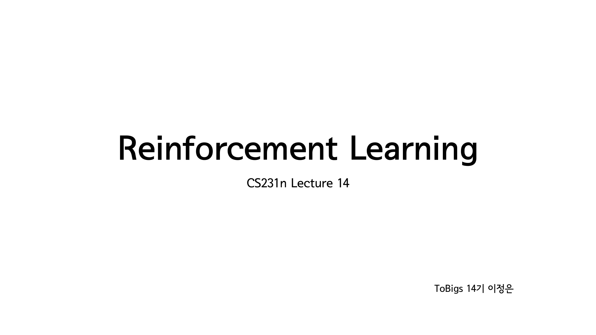
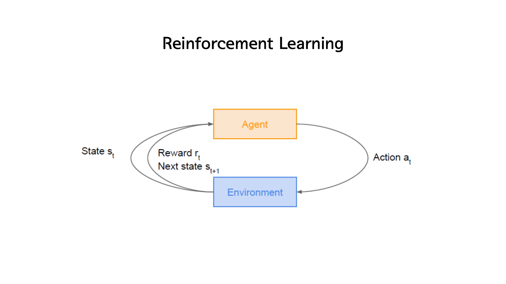
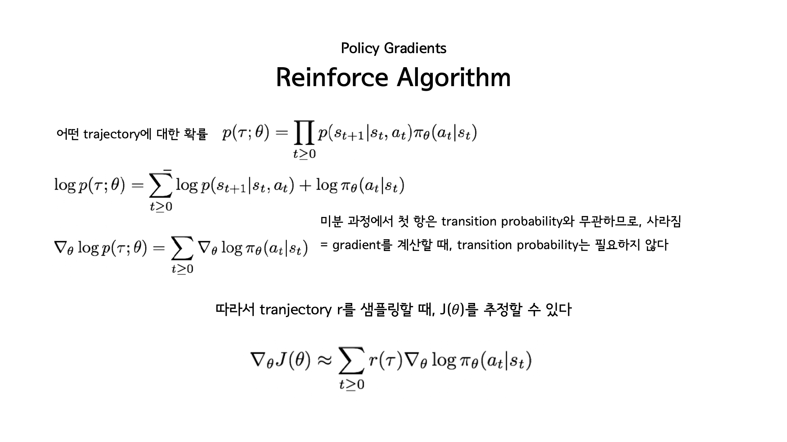
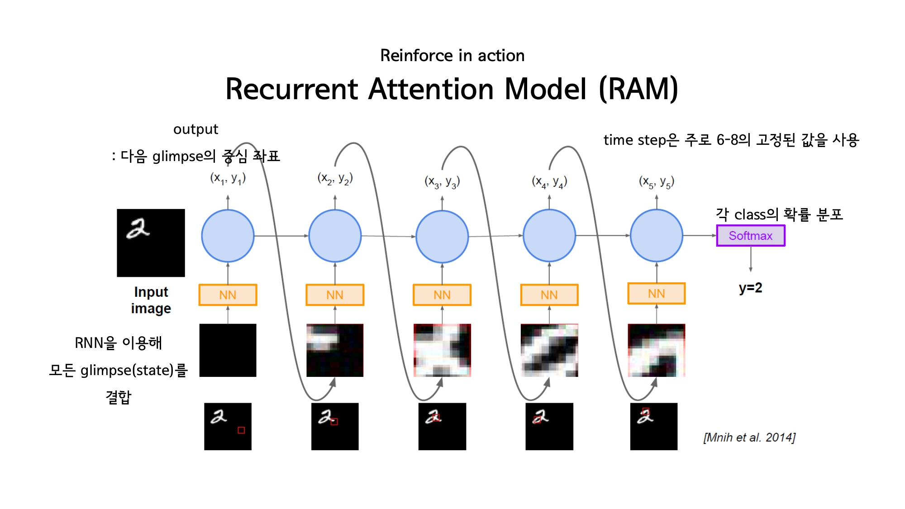

# \[Lecture 14\] Deep Reinforcement Learning

## CS231n 14강 리뷰

14강은 강화학습에 대해 알아본다.

## Reinforcement Learning \(강화학습\)

**Reinforcement Learning\(강화학습\)**은 **agent**가 최대 **reward**를 받을 수 있는 **action**을 취하도록 학습 시키는 것을 목적으로 한다. 이는 달리 말하면 최적의 **정책 함수\(policy\)**를 찾는 것과 같은 의미이다.

강화학습을 설명하기 위해 필요한 중요한 용어들이 있다.

**state\(상태\)**는 agent가 action을 선택하기 위해 받는 정보를 의미한다. 각 **agent\(주체\)**는 environment에서 action을 취하는 주체이며, **action**은 agent가 특성 state에서 취할 수 있는 행동을 말한다. 각 agent가 action을 취하면 reward\(보상\)을 받게 된다. 이 모든 것들이 일어나는 배경을 **environment\(환경\)**이라고 한다. 

agent가 특정 state에서 어떤 action을 취할지 골라주는 함수를 **policy\(정책\)**이라고 하며, 시작부터 종료까지 agent가 거친 일련의 \(state, action, reward\) 시퀀스를 **episode\(에피소드\)**라고 한다.

environment는 agent의 action에 따라 reward를 제공하고, 다음 state를 부여한다.

위 과정은 종료 상태가 될 때까지 즉, 하나의 에피소드가 끝날 때까지 반복된다.

다음은 강화학습의 예시이다.

각각 막대기를 세우거나, 로봇을 움직이거나, 높은 점수를 받거나, 게임에서 이기는 등의 목적을 갖고 있는 강화학습이다.

## Markov Decision Process \(MDP\)

**Markov Decision Process\(MDP\)**는 강화학습 문제를 수식화한 것다. 

**Markov Property**는 현재가 주어졌을 때,  과거와 미래는 독립인 t+1번째 state는 오로지 t번째의 state에만 의존하는 것을 의미한다. MDP는 Markov Property를 만족하고, 이는 \(S, A, R, P, r\)로 정의한다.

이 중 **P**는 **transition probability**로 특정 state에서 다음 번에 도달할 state들의 확률 분포를 의미한다.  
**r**은 **discount factor**로 미래의 가치를 현재 가치로 환산하는 것이다. 이는 같은 reward라면 빨리 얻는 것이 좋다는 것을 내포하고 있다.

위에서 본 강화학습 과정을 MDP를 통해 표현하면 다음과 같다.

간단한 MDP의 예시로 Grid World가 있다.  
Grid World는 시작 지점에서 끝 지점까지 최소한의 움직임으로 도달하는 것을 목표로 한다. 

Stochastic Policy는 ****2가지로 나눌 수 있다. **Random Policy**는 모든 action이 같은 확률을 가지는 경우이다. Optimal Policy 학습을 통해 얻은 정책으로, 얼마나 종료 지점에 가깝에 이동할 수 있는지에 따라 다른 확률을 가진다.

### Optimal Policy pi\*

즉, **최적의 정책 pi\***는 reward의 합을 최대로 만드는 정책을 의미한다.

실제 초기 상태를 샘플링할 때, 전이 확률 분포 등에서는 다음 상태가 확률적이다. 이러한 randomness를 다루기 위해서 **reward의 합의 기댓값을 최대화**하여 최적의 정책 pi\*를 계산하게 된다.

### Value Function & Q-value Function



