# \[Lecture 7\] Training Neural Networks II

## CS231n 7강 리뷰

부제: 옵티마이저 정복기

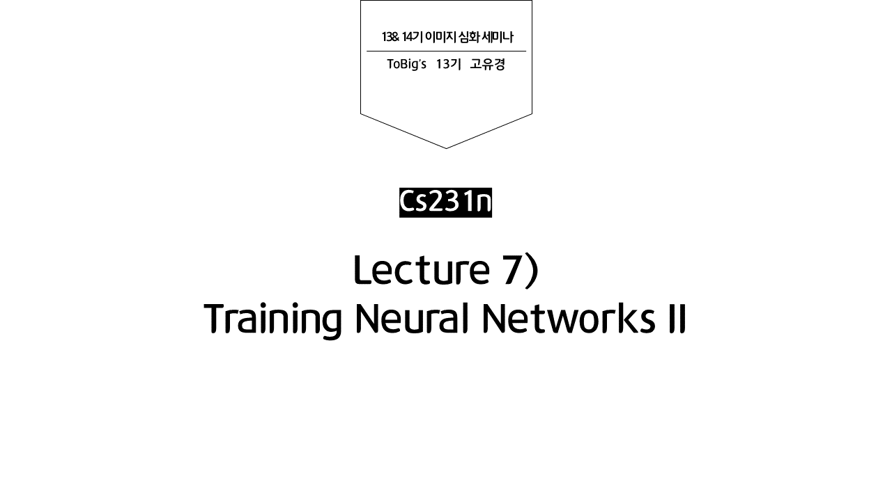

   6강에 이어 이번 강의에서는 **Optimization\(최적화\), Regularization\(규제화\), Transfer Learning\(전이 학습\)**을 다룬다. CNN이라기보다 전반적인 뉴럴넷에 관한 내용이기 때문에, 이미지 뿐만 아니라 딥러닝을 공부하는데 매우 중요한 파트라 할 수 있다.

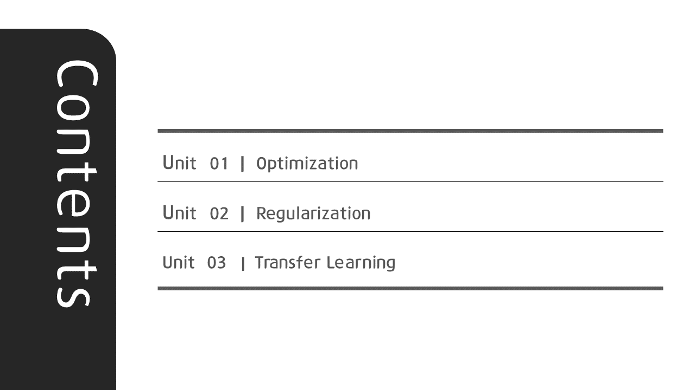

## 1. Optimization

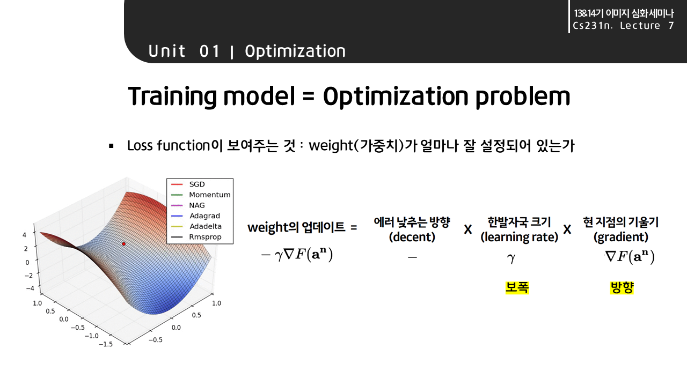

   딥러닝에서 **모델을 학습**시킨다는건 **최적화\(optimization\)** 태스크를 수행하는 것과 같다. 여기서 최적화란, 좌측 그래프처럼 정의된 **손실 함수\(loss funciton\)의 최소값**을 찾아나가는 일련의 과정을 말한다. 최적화는 **역전파\(Backpropagation\)** 과정 중에 **가중치를 업데이트**하면서 진행되는데, 이 때 한 스텝마다 이동하는 발자국의 크기, 즉 **보폭**이 **학습률\(learning rate\)**로 정의되고, 앞으로 이동할 **방향**은 현 지점의 **기울기\(gradient\)**를 통해 정의된다. 매 스텝마다 순전파\(forward pass\)의 끝단에서 계산되는 손실 함수값은 지금까지 업데이트된 가중치들이 얼마나 잘 설정되어 있는지를 나타내는 지표와도 같다.

  

### 1.1. SGD

   손실함수의 최소값을 찾아나가는 과정은 기본적으로 손실 함수를 차근차근 밟아 내려가는 Gradient Descent 알고리즘으로 정의된다. **Batch Gradient Descent**는 한 번 학습할 때 **모든 학습데이터**를 가지고 연산을 진행하고, 이에 따라 연산량이 많아 학습 속도가 느린 단점이 있다.

   이에 반하여 등장한 **Stochastic Gradient Descent** \(이하, SGD\)는 한 번에 전체 학습데이터에서 **하나씩 랜덤으로** 뽑아 학습을 진행한다. 이와 비슷한 **Mini-batch Stochastic GD**도 있는데, 이 경우 하이퍼파라미터로 정의된 **batch\_size\(k개\)** 만큼의 데이터를 랜덤으로 뽑아 한 회 학습에 이용한다. SGD와 Mini-batch SGD는 둘 다 **학습이 빠르게** 이뤄진다는 장점이 있지만, 좌측 하단 그림의 빨간 선처럼 **지그재그로 핑퐁**하면서 **불안정한 학습**과정을 보인다. 또한, 우측 2개의 그래프처럼 **local minima\(지역 최소점\)과 saddle point\(안장점\)에 빠질 수 있다는 치명적인 단점**이 있다. 

   이러한 SGD의 문제점을 해결하기 위해 여러 개의 **옵티마이저\(optimizer\)**들이 차례로 등장하게 된다.

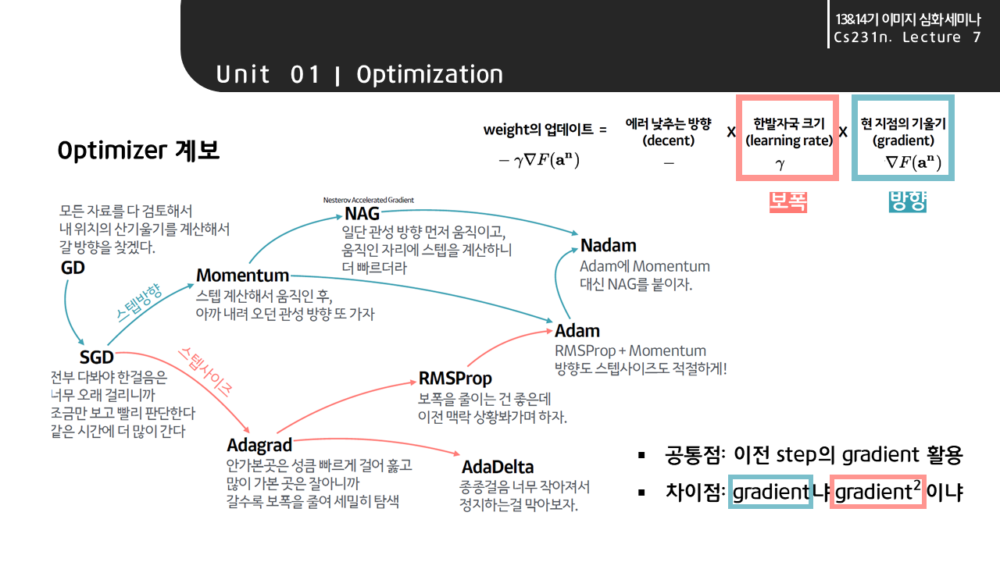

   상당히 많고 어렵다.. 따라서, 하나하나 뜯어서 살펴보되, 한 눈에 정리해서 **옵티마이저 별 논점만 기억**하는 것을 추천한다. 위 장표의 옵티마이저 계보는 [하용호님의 슬라이드](https://www.slideshare.net/yongho/ss-79607172/)에서 발췌했다. \(본문 하단 references에도 언급해두었지만, 딥러닝을 공부하면서 만나봤을 개념들을 깔끔하게 정리해준 자료로 시간내서 한 번 읽어보시길 강력 추천한다!\)

   옵티마이저들은 **보폭을 중심으로 하느냐\(분홍색\), 방향을 중심으로 하느냐\(파란색\)**에 따라 크게 두 가지 갈래로 나뉜다. 여기서 유의할 점은 두 갈래 모두 이전 step의 gradient를 활용하는데, **방향**을 중심으로 하는 옵티마이저들은 **gradient**를, **보폭**을 중심으로 하는 옵티마이저들은 **graident의 제곱**을 연산에 활용한다.

  먼저 파란 갈래, 즉 방향을 중심으로 하는 옵티마이저부터 살펴보자.

### 1.2. SGD + Momentum

  Momentum은 기존 **SGD에서 velocity term이 추가**된 버전이다. 이름에서도 알 수 있듯이, 이 velocity term은 속도를 조절하는 역할을 맡아 **관성\(momentum\) 효과**를 낸다. 식을 살펴보았을때, 매 스텝마다 gradient가 동일한 부호를 가지면 v의 절댓값은 계속 증가할 수 밖에 없다. v가 증가함에 따라 x의 변화폭이 커지고, 이는 즉 같은 방향으로 이동할수록 더 많이 이동하게 하여 가속화한다는 말과 같다. 이러한 특징 덕분에 위에서 SGD의 한계점으로 언급되었던 local minima나 saddle point에서 gradient가 0에 수렴하는 값을 가진다 하더라도 이전 step들에서 축적되어온 v값이 더해지며 멈추지 않고 옆으로 탈출할 수 있게 되는 것이다..!

### 1.3. Nesterov Momentum

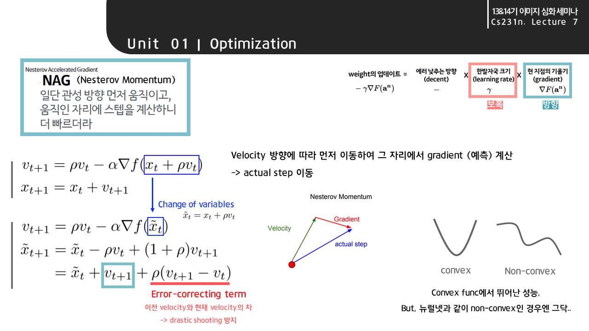

  이어서 NAG은 momentum과 비슷하지만 살짝 다르다. 이전 스텝의 velocity 방향을 따라 먼저 이동하여\(실제로 이동하는 것은 아니다!\) 그 자리에서 gradient를 계산하고 다시 본래 자리로 돌아와 actual step을 이동한다. **gradient를 계산하는 지점과 실제 이동하는 지점이 다르다**는 이야기인데, '왜 굳이..?' 라는 생각이 들 수 있다. 이렇게 되면 새롭게 변화되는 식에서 **error-correcting term**이라는 것이 생기는데 이는 이전 velocity와 현재 velocity의 차이를 반영하여 **급격한 슈팅을 방지**한다는 측면에서 효과가 있고 더 빠른 학습을 가능하게 한다고 한다.

### 1.4. AdaGrad

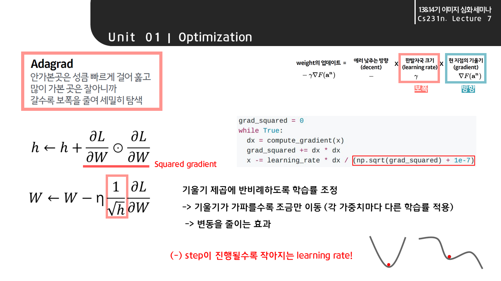

다음으로 분홍 갈래, 즉 **보폭을 중심으로 하는 옵티마이저**를 살펴보자. 위에서도 언급했듯이 보폭을 중심으로 하는 옵티마이저들은 기울기의 제곱을 연산에 활용한다. Adagrad의 경우 **squared gradient\(기울기 제곱\)에 반비례하도록 학습률을 조정**하는데, 이는 기울기가 가파를수록 조금만 이동하고, 완만할 수록 조금 더 이동하게 함으로써 **변동을 줄이는 효과**가 있다. 무엇보다 행렬곱 연산을 통해 **가중치마다 다른 학습률**을 적용한다는 점에서 더욱 정교한 최적화가 가능해진다.

그런데 문제가 있다. 아무리 좋은 값이라 하더라도 결국 학습이 진행될 수록 h는 축적된다. h의 값이 커질 수록 이와 반비례하여 이동하는 보폭은 줄어들게 된다. 그럼 결국엔 어떻게 될까? **기울기가 0인 부근에서 학습이 급격하게 느려져** SGD의 문제로 언급되었던 local minima와 saddle point에 빠지게 될 것이다. 이 문제를 해결하고자 아래 RMSProp이 등장하게 된다.

### 1.5. RMSProp

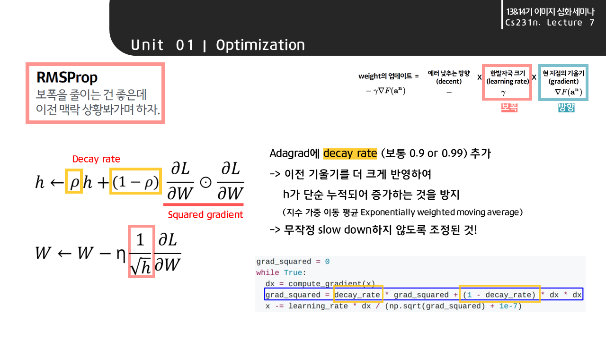

  RMSProp의 식은 위 Adagrad 식과 크게 다르지 않다. 핵심은! **보폭을 갈수록 줄이되, 이전 기울기 변화의 맥락을 살피자**는 것이다. Adagrad식의 h와 squared gradient에 각각 **p,\(1-p\)의 decay rate**가 붙는다. 보통 p=0.9 정도로 설정되어 이렇게 되면 **이전 스텝의 기울기를 더 크게 반영**하여 h 값이 단순 누적되는 것을 방지할 수 있다. 이 과정을 있어보이는 말로 **"지수 가중 이동 평균"**이라고 한다. 무작정 보폭을 줄이지 않도록 옆에서 말리는\(?\) 역할이라고 이해해도 좋을 듯 하다 ㅎ

### 1.6. Adam

   대망의 아담이다. 앞서 등장한 두 갈래의 옵티마이저들의 집합체로 보면 된다.

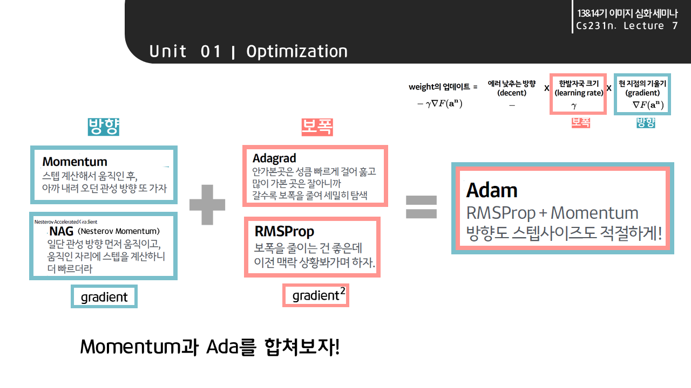

방향을 중심으로 한 Momentum 계열과 보폭을 중심으로 한 Ada계열이 합쳐져, 보폭도, 방향도 적절하게 조절하는 우주최강보스 옵티마이저가 등장하였다!

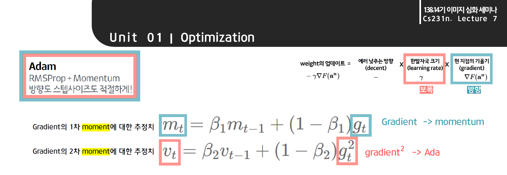

   또 나와버린 새로운 식에 당황하지말고 우리가 아는 것부터 천천히 찾아보자.

> 1. $$m_t$$의 식에서 파란색 박스 속 $$g_t$$를 보니 이 친구는 **gradient를 중심으로 하는 모멘텀** 계열이겠구나!
> 2.  그 아래 분홍색 박스 속 $$g_t^2$$를 보니 $$v_t$$는 **gradient 제곱에 반비례하는 ada, rmsprop** 계열이겠구나!
> 3. $$m_t$$와 $$v_t$$모두 rmsprop 슬라이드에서 봤던 **decay rate가 포함된 가중평균식과 비슷**하네!

   이 정도만 파악했어도 절반은 온 것이다. 이제 다음 단계로 넘어가보자.

   슬라이드 왼쪽을 보면 **Gradient의 1차, 2차  moment에 대한 추정치**라는 알 수 없는 말이 나온다. 여기서 **moment**는 수리통계학을 공부한 사람이라면 단번에 알아볼 법한 **적률** 개념이다. 

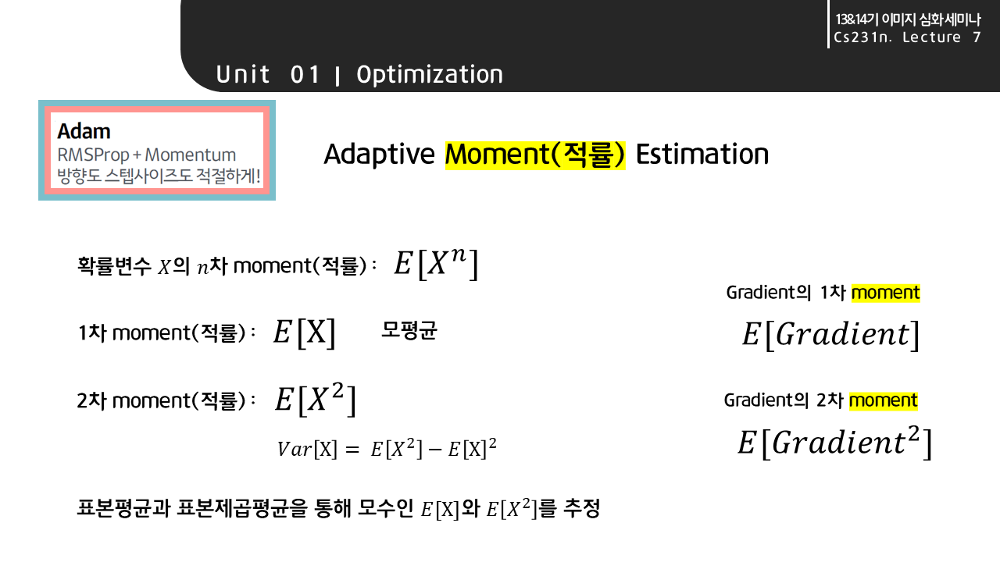

   적률이 생소한 분들을 위해 moment가 가리키는 것이 무엇인지만 간단히 짚고 넘어가고자 한다. 기본적으로 통계학에서 **n차 moment\(적률\)**이라고 하면 $$X^n$$**의 기댓값**을 의미한다. 우리가 흔히 알고 있는 모평균은 원래 X의 1차 적률이었던 것이다. 마찬가지로 분산을 구할때 자주 등장하는 $$E(X^2)$$ ****역시 X의 2차적률이라고 불리는 친구였다. 우리는 표본평균과 표본제곱평균을 통해 모수에 해당하는 이 1차 적률, 2차 적률을 추정하는 것이다.

  이 개념을 그대로 옆으로 들고 오자. 이전 슬라이드에서 나왔던 **Gradient의 1차, 2차  moment에 대한 추정치**는 각각 모수인 $$E(Gradient)$$와 ****$$E(Gradient^2)$$를 추정하는 값이라는 말이다.

자 그럼 이렇게 구해진 추정치 m과 v가 가중치 업데이트 식에 바로 쓰이느냐? 그건 또 아니다. 아직 한 단계가 더 남아있다. 통계학에서 **불편추정치**라는 개념이 존재하는데 편향\(bias\)가 0인 추정치를 말한다. 무슨 말인지 받아들이기 어렵다면 우리가 구하는 추정치들 중에 가장 좋은 친구가 불편추정치라고만 생각해두자.

위 식에서 만약 m과 v의 초기값이 0이면 베타가 1에 가깝기 때문에 v가 0에 가까워져 1/v는 발산하게 되어 너무 많이 이동해버리는 편향된 결과를 보일 수 있다. 따라서 이러한 편향을 잡아주기 위해 불편추정치를 계산하여 가중치 업데이트 식에 적용하는 것이다. 

### 1.7. 그 외

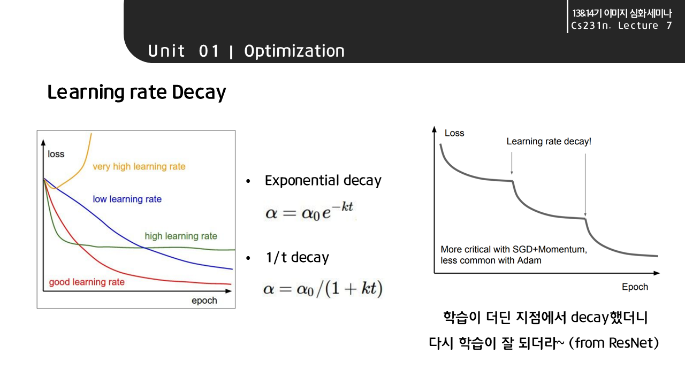

  옵티마이저 외에도 학습률을 조정하는 방법들이 존재한다. 오른쪽 그래프는 ResNet에서 학습이 진행되면서 속도가 더딘 지점에서 학습률을 작게 조정했더니 다시 학습이 잘 되는 양상을 보이더라~는 요지이다. 중요한 점은 **처음부터 쓰는 것이 아니라 학습과정을 본 후에 필요하다고 판단되는 시점**에 써야한다는 것이다.

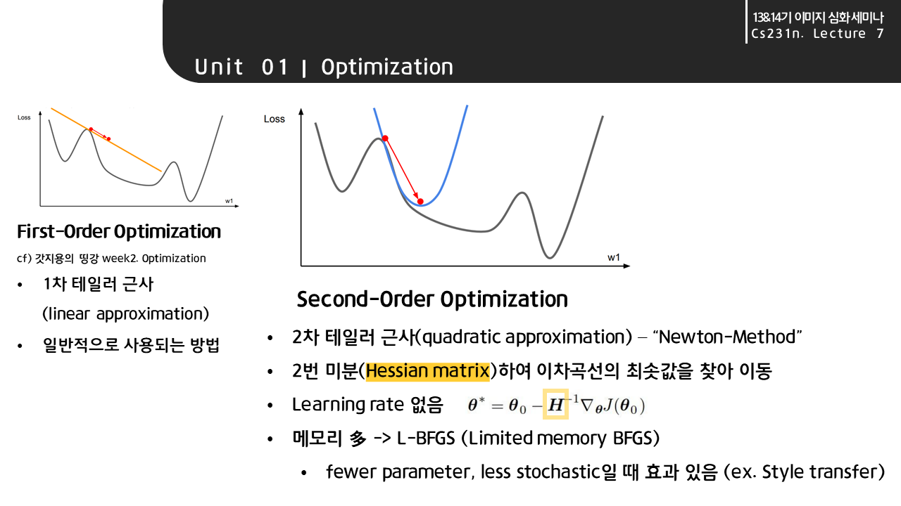

일반적으로 우리는 최적화 과정에서 한 스텝씩 이동할때마다 gradient를 계산할때 1차 테일러 근사 기법\(흔히 아는 직선의 기울기 구하는 방식\)을 활용한다. 이외에도 **2차 테일러 근사 기법**에 기반한 Second-Order Optimization이라는 것이 존재하는데 어려운건 아니다. 그림에서 보이는 것처럼 매 지점마다 **이차곡선의 최솟값을 찾아 다이렉트로 이동**하고 따라서 **learning rate가 존재하지 않는다**. 다만 미분되는 값들이 다 저장되면서 메모리를 많이 잡아먹어 이를 해결하고자 L-BFGS라는 방법이 등장하기도 하였다. 

## 2. Regularization

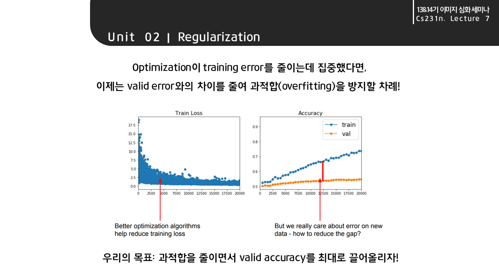

최적화 과정이 train error를 줄이는데 집중했다면 이제는 valid error와의 차이를 줄여 과적합을 방지할 차례이다. 알다시피 **과적합은 딥러닝의 고질병**이자 고질병이자 고질병이다.. **과적합을 줄이면서 valid acc를 높이기 위해 우리는 적절한 규제기법들을 학습에 도입**한다. 

### 2.0. Model Ensembles


Model Ensemble은 규제화 기법이 아니다!


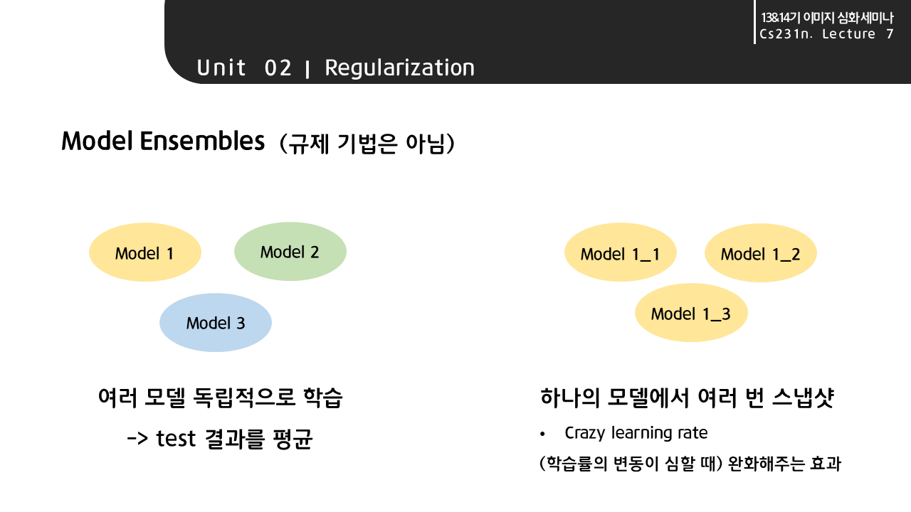

정확하게 말해서 모델 앙상블은 규제 기법이 아니다.  하지만 최적의 test 결과를 내기 위한 방안이기 때문에 규제 기법들과 함께 소개하고자 한다. 머신러닝에서의 앙상블처럼 **여러 모델을 독립적으로 학습하여 test 결과를 평균**내는 것이다. 또 다른 방식으로는 모델 하나의 학습과정에서 여러번 캡쳐하듯 스냅샷을 찍어 **학습률이 크게 변동할 때 이를 완화**해주는 효과를 노리기도 한다.

이제 단일 모델에서 과적합을 방지하기 위한 규제기법들을 살펴보자.

### 2.1. L1&L2 Regularization

L1,L2 Regularization은 통계학의 **가설검정과 유사**하다. 가설검정 시 t값이나 F값, 혹은 p-value를 통해 **유의미한 변수인지 아닌지를 판단**하는 것처럼 regularization은 **loss를 줄이는데 기여하지 못하는 모수를 0\(L1\) 또는 0에 가까운\(L2\) 값으로 제한**하는 기능을 한다. 보통 L2 regularization이 L1보다 더 많이 쓰이고, **출력 직전 층에 적용**하면 과적합 해소에 상당한 기여를 한다. 본 강의에서는 딥러닝에서 큰 효과가 없다고 언급했지만 개인적으로 학교 강의와 실습을 통해 효과를 본 기법이다.

### 2.2. Dropout

   다음으로 아주아주 유명하고 그만큼 자주 쓰이는 dropout 기법이다. 슬라이드를 기준으로 두 탭으로 나누어 설명하겠다.

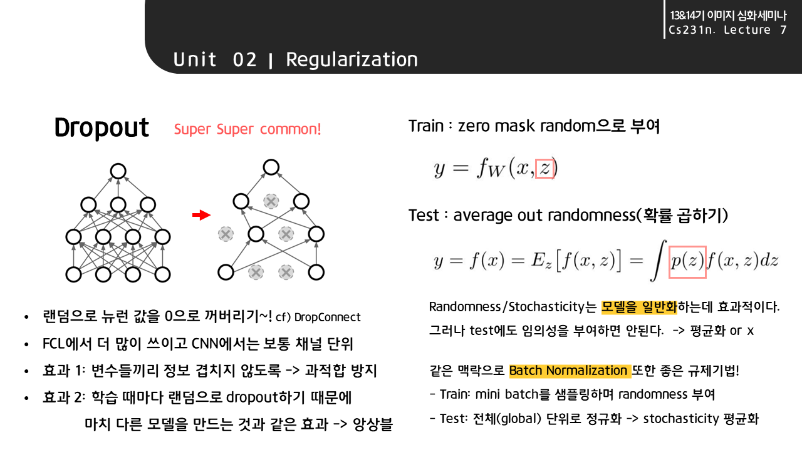



  Dropout이란 **랜덤으로 뉴런 값을 0으로 보내버리는** 것이다. 비슷한 개념으로 DropConnect는 가중치를 0으로 만든다. Fully Connected Layer에서 더 많이 쓰이며 CNN에서는 보통 채널 단위로 적용된다. 왜 소중한 뉴런들을 0으로 꺼버리느냐? 우선 모델이 학습을 하다 보면 **비슷한 정보를 가지는 노드**가 생기기 마련이다. 이는 과적합을 야기할 수 있기 때문에 입력값의 일부를 0으로 두어 역전파시 파라미터 업데이트가 되지 않고, 이는 **모형의 불확실성을 증가시켜 과적합 해결에 기여**하게 된다. 또한, 학습 때마다 **랜덤으로 dropout**하기 때문에 마치 다른 모델을 만드는 것과 같은 효과를 보여 **앙상블 효과**를 내기도 한다.



   dropout을 train data로 모델을 학습시킬 때만 활용하고 test data를 적용할때는 사용하지 않는 것으로만 알고 있는 사람들이 많을 것이다. **테스트할때 dropout이 아예 쓰이지 않는 것은 아니다.** 여기서 정확히 짚고 가자. 우선 학습시에 zero mask를 랜덤으로 부여한다. 하지만 Test시에도 학습 때처럼 임의성을 부여하기 안되기 때문에 위 식처럼 **확률값을 곱하여 기댓값을 구해 평균화**하거나 혹은 그냥 사용하기도 한다.

 이와 같은 맥락으로 BN\(배치정규화\)도 좋은 규제 기법이라할 수 있는데 그 이유는, train에서 mini batch를 샘플링하며 임의성을 부여하고 test에서는 전체 단위로 정규화하여 평균화하는 효과를 내기 때문이.  이제 **규제기법들의 패턴**이 어느 정도 보일 것이다. 한 가지 방법을 더 보도록 하자.



### 2.3. Data Augmentation

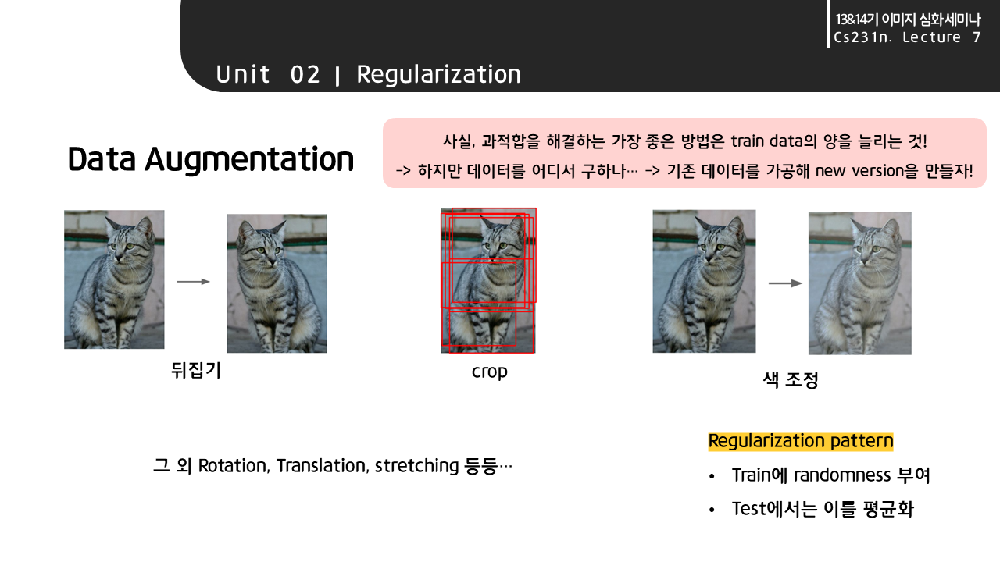

 사실.. 제 아무리 규제 기법을 쓴다 한들 **학습데이터를 늘리는 것 만큼 과적합 해결에 효과적 방법은** 또 없다. 하지만 우리가 데이터를 늘리고 싶다고 해서 늘릴 수는 없지 않은가. 그럼에도 불구하고 똑똑한 사람들은 방법을 만들어냈다. 바로 **기존 데이터를 가공해서 새로운 버전을 만드는** 것이다. 위 슬라이드의 예시처럼 고양이 사진을 뒤집거나, 자르거나, 색을 조정하여 새로운 학습데이터를 만들어낸다. 데이터가 늘어나면 학습시에 임의성이 부여되기 때문에 모델의 일반화에 용이하다.

  지금까지 보았던 규제기법들은 일정한 패턴을 가지고 있다. 우선 학습시에 모델에 randomness, 즉 임의성을 부여하고 test에서는 이를 평균화하여 균일하게 학습효과가 적용되도록 한다.

### 2.4. 그 외

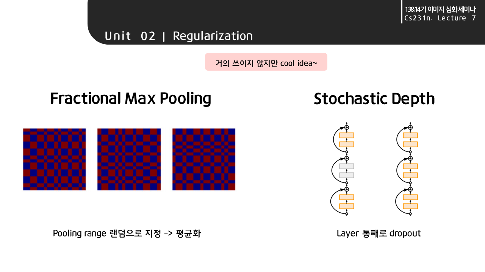

거의 활용되지는 않지만 Cool idea로 소개된 2가지 방법도 있다. 우선 **Fractional Max Pooling**은 CNN에서 pooling range가 차례로 훑는 식으로 정해지는 것이 아닌 랜덤으로 지정되어 평균화 효과를 도모한다. 다음으로는 **Stochastic Depth**라 하여 노드나 가중치를 0으로 보내는 것이 아닌 layer를 통째로 dropout하는 기법이다.

## 3. Transfer Learning

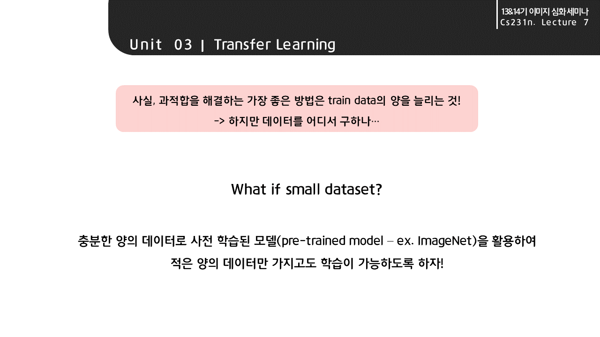

  위에서 과적합 해결을 위해 가장 좋은 방법은 데이터의 양을 늘리는 것이라 하였다. 하지만 데이터를 어디서 구하며.. 만약 우리가 가지고 있는 **데이터가 모델을 학습시키기에 턱없이 부족한 양**이라면 어떻게 해야할까? 방법이 있다. 바로 **충분한 양의 데이터로 이미 학습된 모델을 활용하여 우리의 데이터셋을 학습**시키는 것이다. 이를 전이학습\(Transfer Learning\)이라고 한다.

만약 우리의 데이터셋이 아주 적은 양이라면 마지막 FCL을 제외하고 모든 층의 가중치를 고정시켜 학습시킨다. 조금 더 큰 데이터셋이라면 가중치를 학습시킬 층을 늘리면 된다. 오른쪽 2x2 table은 우리의 데이터와 모델 데이터의 상황에 따라 우리가 생각해볼 수 있는 방법들을 알려주고 있다.

사전학습모델을 활용하여 미세조정\(fine-tuning\)하는 전이학습은 실제 프로젝트에서도 많이 쓰이는 방법이니 잘 기억해두도록 하자!

## References

* Stanford cs231n 7강

  [http://cs231n.stanford.edu/syllabus.html](http://cs231n.stanford.edu/syllabus.html)

  [https://www.youtube.com/watch?v=\_JB0AO7QxSA&t=2149s](https://www.youtube.com/watch?v=_JB0AO7QxSA&t=2149s)

* \[딥러닝\]딥러닝 최적화 알고리즘 알고 쓰자. 딥러닝 옵티마이저\(optimizer\) 총정리[https://hiddenbeginner.github.io/deeplearning/2019/09/22/optimization\_algorithms\_in\_deep\_learning.html](https://hiddenbeginner.github.io/deeplearning/2019/09/22/optimization_algorithms_in_deep_learning.html)
* 딥러닝\(Deep learning\) 살펴보기 2탄

  [https://seamless.tistory.com/38](https://seamless.tistory.com/38)

* 자습해도 모르겠던 딥러닝, 머리속에 인스톨 시켜드립니다. _\(개인적으로 강추!!!하는 자료\)_

  [https://www.slideshare.net/yongho/ss-79607172](https://www.slideshare.net/yongho/ss-79607172)

* cs231n 2017 강의 7강 training neural networks part2 정리

  [https://lsjsj92.tistory.com/405](https://lsjsj92.tistory.com/405)

