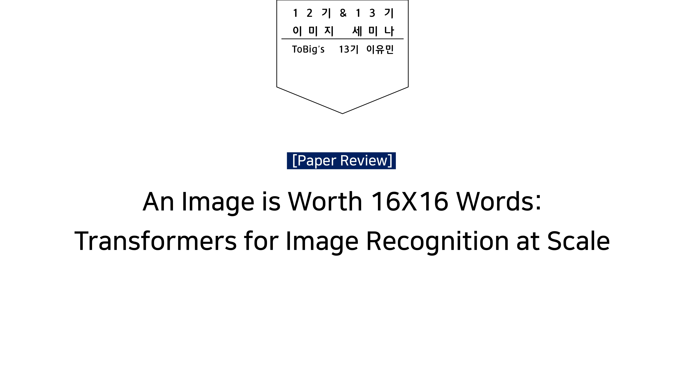
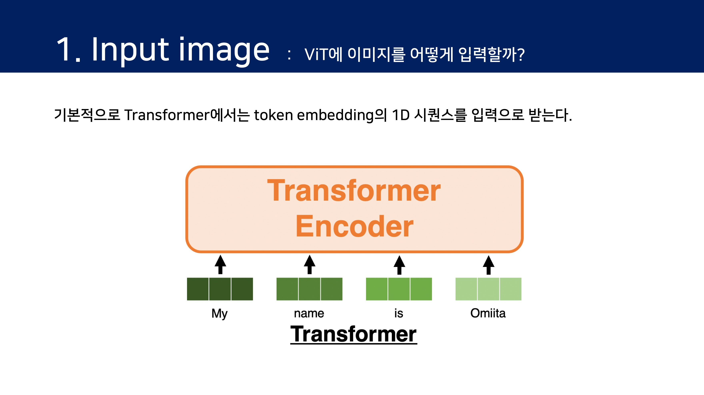

# \[Paper Review 1\] An Image is Worth 16x16 Words: Transformers for Image Recognition at Scale

**An Image is Worth 16X16 Words: Transformers for Image Recognition at Scale**  
Alexey Dosovitskiy, Lucas Beyer, Alexander Kolesnikov, Dirk Weissenborn, Xiaohua Zhai, Thomas Unterthiner, Mostafa Dehghani, Matthias Minderer, Georg Heigold, Sylvain Gelly, Jakob Uszkoreit, Neil Houlsby  
[https://arxiv.org/abs/2010.11929](https://arxiv.org/abs/2010.11929)

## 0. Abstract 

이번 리뷰에서는 현재 AI계에서 큰 관심을 받고 있는 "Vision Transformer"\(이하 ViT\)에 대해 다룬다. 

자연어 처리 분야에서 널리 사용되고 있는 Transformer 구조는 아직 컴퓨터 비전 분야에서 적용된 사례가 거의 없다. 지금까지의 attention은 컴퓨터 비전에서 CNN 구조에 주로 적용되어, 전체 구조를 유지하면서 bottleneck에서 attention하는 방식으로 진행되었다. 

본 논문에서는 이렇게 특정 구성 요소를 대체하는 것에 그치지 않고 image patch의 seqeuence에 Transformer를 적용하면 이미지 분류 task에서 우수한 성능을 보인다는 것을 발견했다. 많은 양의 데이터로 사전 학습\(pre-trained\)을 수행하고, 여러가지 ****recognition benchmark\(ImageNet, CIFAR-100, VTAB 등\)에 대해 transfer learning을 수행하면 학습과정에서 SOTA보다 훨씬 적은 계산량으로 우수한 결과를 얻을 수 있다.

&gt;&gt; Transformer의 계산 효율성과  scalability를 비전에 활용한다!

### **※ Transformer in NLP**


Long-term Dependency problem

Solution : LSTM\(Long Short Term Memory-&gt; Attention

어텐션으로 인코더/디코더로 구현한 것 :  transformer!


## 1. Introduction 

NLP에서 Transformers는 대부분 large text corpus에서 pre-train을 수행하고, task-specific dataset에 대해 fine-tuning을 수행하는\(BERT\) 방식으로 접근한다.

Transformers의 계산 효율성 및 확장성으로 100B 이상의 parameter를 사용하여 큰 모델을 학습 할 수 있게 되었다. 하지만 computer vision 분야에서는 여전히 CNN을 많이 사용하고 있으며 몇몇 연구에서 CNN과 비슷한 아키텍처와 self-attention의 결합을 시도해 왔다. 연구 예시는 아래 링크로 대체한다. 

* [Wang et al., 2018](https://arxiv.org/abs/1906.01787); [Carion et al., 2020](https://arxiv.org/abs/2005.12872) 
* [Ramachandran et al., 2019](https://arxiv.org/abs/1906.05909); [Wang et al. , 2020a](https://arxiv.org/abs/2003.07853)\).

본 논문에서는 NLP의 Transformer 에서 모델을 가능한 수정하지 않으면서 Transformer 를 이미지에 직접 적용해본다. 

**이를 위해 1\)이미지를 패치로 분할하고, 2\)이러한 패치의 선형 임베딩 시퀀스\(linear embedding sequence\)를 Transformer의 입력으로 한다. 이 때, 이미지 패치는 NLP 에서 token\(word\)와 동일한 방식으로 처리된다.** 

모델은 ImageNet 과 같은 중간 규모의 데이터셋에서 학습할 때 비슷한 크기의 ResNet 보다 약간 낮은 정확도를 달성한다. **이는 equivariance 및 locality 즉 CNN 고유의 inductive bias 를 고려할 수 있는 기능이 transformer 에 없기 때문에 불충분한 양의 데이터에 대해 학습할 때 일반화가 잘 되지 않는 문제가 있기 때문이다.**

하지만, 큰 규모의 데이터셋에서 **모델을 학습하면 inductive bias 를 뛰어넘을 수 있다. 다시 말해, 충분한 규모로 사전 학습되고 더 적은 데이터로 fine tuning 할 때 좋은 결과를 얻을 수 있다는 것이다.** JFT-300M 데이터 세트에 대해 사전 훈련 된 Vision Transformer는 여러 Image Recognition Benchmark에서 SotA에 접근하거나 이를 능가하여 ImageNet에서 88.36%, ImageNet-ReaL에서 90.77%, CIFAR-100에서 94.55%, 77.16%의 정확도를 달성했다.

## 2. Related Work 

Transformer는 NMT\(Neural Machine Translation\)을 위한 것으로, 많은 NLP task에서 SotA를 달성했다. Large Transformer-based model은 종종 large-scale corpus에 대해 pre-train을 수행하고 해당되는 task에 fine-tuning을 수행한다. BERT는 denoising self-supervised pre-training task를 사용하는 반면 GPT 계열은 language modeling방식으로 pre-train을 수행한다.

Self-attention을 image에 naive하게 적용하려면 각 픽셀이 다른 모든 픽셀에 attention해야한다. 이는 픽셀수의 quadratic cost를 가지고 실제 input size로 확장되지 않는다. 따라서 image generation 측면에서 Transformer를 적용하기 위해 시도된 몇 가지 연구들이 있다.

가장 최근의 연구인 [iGPT](https://cdn.openai.com/papers/Generative_Pretraining_from_Pixels_V2.pdf)는 image resolution과 color sapce를 줄인 후 이미지에 대해 transformer를 적용한다. Model은 unsupervised 방식으로 학습되고 이후 fine-tuning을 수행하거나 linear를 수행하여 ImageNet에서 72%의 정확도를 달성하였다. 해당 연구는 SotA결과를 얻기 위해 추가적인 데이터에 의존한다.

[Sun et al.\(2017\)](https://arxiv.org/abs/1707.02968)은 CNN 성능이 dataset 크기에 따라 어떻게 확장되는지 연구하고 [Kolesnikov et al. \(2020\)](https://arxiv.org/abs/1912.11370); [Djolonga et al. \(2020\)](https://arxiv.org/abs/2007.08558)은 ImageNet-21k 및 JFT-300M과 같은 large-scale dataset에서 CNN transfer learning에 대한 경험적 탐색을 수행하며, 모두 이번 논문에서 초점을 두고 있다.

## 3. Method 

해당 부분 설명은 세미나 발표에서 사용한 슬라이드를 토대로 리뷰했다.


#### Model flow

모델은 이미지를 고정된 크기의 패치로 쪼개고, 각각을 선형적으로 임베딩한 후 위치 임베딩을 더하여 결과 백터를 일반적인 Transformer 인코더의 인풋으로 입력한다. 분류 과제를 수행하기 위해 추가적으로 학습되는 "classification token"을 만들어 시퀀스에 더한다.


###  

### 3.1 Vision Transformer\(ViT\) 

편의상 image input과 architecture 부분으로 나누어 설명한다.

지금부터는 아래 수식에 대해 살펴다.

### 3.2 Fine-tuning and Higher Resolution 

일반적으로 대규모 데이터 세트에 대해 ViT 를 pre-train 하고 downstream task를 find-tuning 한다. 이를 위해 pre-train 된 prediction head 를 제거하고 0으로 초기화한 D x K feedforward layer를 연결\(K: downstream class 의 수\)한다. pre-train 보다 높은 해상도로 fine-tuning 을 하는 것이 성능에 도움이 된다. 

Pre-train 보다 높은 resolution으로 fine-tuning하는 것은 종종 도움이 되며, 더 높은 resolution의 이미지를 feed할 때 patch 크기를 동일하게 유지하므로 sequence length가 더 길어진다. Vision Transformer는 임의의 sequence length\(up to memory constraint\)를 처리할 수 있지만 pre-trained position embedding은 의미가 없을 수 있다. 따라서 원본 이미지에서의 position에 따라 pre-trained position embedding의 2D interpolation을 수행한다. 이와 같은 해상도 조정과 패치 추출은 이미지의 2D 구조에 대한 inductive bias가 Vision Transformer에 수동으로 적용되는 유일한 부분으로 볼 수 있다.

## 4. Experiments 

ResNet, Vision Transformer\(ViT\) 및 Hybrid에 대해 representation learning 검증을 수행한다. 다양한 크기의 dataset에 대해 pre-train하고 benchmark를 수행한다.

pre-training 계산비용을 고려할 때 ViT는 더 낮은 비용으로 대부분의 recognition benchmark에서 SotA를 달성하였다.

### 4.1 Setup 

**Datasets.**  
Pre-train dataset

* ILSVRC-2012 ImageNet : 소규모, 클래스 1000개, 130만 장의 이미지
* ImageNet-21k : 중간 규모, 클래스 21,000개, 1400만 장의 이미지
* JFT-300M : 대규모, 클래스 18000개, 약 3억 장의 이미지. 구글의 private dataset

Transfer Learning dataset

* ImageNet 
* ReaL labels : 평가용 라벨
* CIFAR 10/100
* Oxford-IIIT Pets
* Oxford Flowers-102
* 19-task VTAB classification suite
  * Natural : 일반적인 이미지 데이터
  * Specialized : 의료 데이터 등, 전문적인 이미지 데이터
  * Structured : 인공 3D 공간 등, 이미지 데이터 세트

**Model Variants.**

* BERT에 사용되는 구성을 기반으로 함.
* 접미사는 “B”\(Base\), “L”\(Large\), “H”\(Huge\) 를 뜻함.
* 예를들어 ViT-L/16 의 경우는 Large 사이즈 이며 16x16 의 패치크기를 가짐.

**Training & Fine-tuning.**  
Pre-train

* Adam optimizer
* batch size=4096, β1​=0.9,β2​=0.999
* image size=224
* weight decay: 0.1

Fine-tuning

* SGD with momentum \(모멘텀이 딸린 SGD\)
* batch size=512
* image size=384
* using linear learning rate warm-up and decay
* Higher resolution: 512 for ViT-L/16 and 518 for ViT-H/14

### 4.2 Comparison to State of the Art 

SoTA와의 비교

ViT-L/16 모델은 모든 dataset에서 BiT-L과 일치하거나 더 좋은 성능을 보여 준다. 또한 훨씬 적은 computational resource를 필요로 한다. 더 큰 모델인 Vit-H/14는 ImageNet, CIFAR-100, VTAB에서 더욱 좋은 성능을 보인다.

또한 TPUv3-days을 통해 JFT-300M의 사전학습에 걸린 시간을 살펴 보면,  BiT과 NoisyStudent에서는 약 만 TPUv3-일, 반면 ViT-H/14에서는 약 1/4~1/5 정도로, ViT-L/16에서는 BiT-L보다 약간 더 좋은 성능을 약 1/15일만에 달성다.

 VTAB 전체/ Specialized/Structed에서 ViT-H/14 가 제일 좋은 성능을 내고 있다. 


ViT는 전이학습에 폭넓게 효과적이다.


### 4.3 Pre-training Data Requirements 

ViT는 large-scale JFT-300M dataset에서 pre-train 한 결과 좋은 성능을 보여준다. 

지금부터는 사전학습에 사용하는 dataset의 크기가 어느 정도의 영향을 끼치는지에 대해 실험하고, Hybrid와의 효율을 비교한다. Hybrid는 입력 패치를 ResNet에 삽입한 ViT를 의미한다.

가장 작은 dataset인 ImageNet에 pre-train을 수행한 경우 ViT-Large 모델은 ViT-Base보다 낮은 성능을 보인다. 그러나 ImageNet-21k dataset에서는 비슷한 성능을, JFT-300M dataset에서는 ViT가 BiT보다 더 좋은 성능을 보여준다.

따라서 작은 dataset의 경우 convolutional inductive bias가, 큰 dataset의 경우 ViT가 관련 패턴을 학습하는 것이 충분하고 이점이 있어 보다.

### 4.4 Scaling Study 

Hybrid와의 비용 대비 성능을 비교해 보자.

다양한 크기의 ResNet\(5개\) / ViT\(6개\) / Hybrid\(4개\)를 JFT-300M으로 사전학습시켰다. 이 때의 계산량과 전이학습에서의 정밀도를 표로 나타낸 것이 Figure5이다. 전이학습의 결과는 Average-5\(좌측\)과 ImageNet\(우측\)이다. 여기서 Average-5에 대한 설명은 논문에 없지만, ImageNet/CIFAR10/CIFAR100/Pets/Flowers 5개의 데이터 세트에 대한 평균치로 이해했다.

1. ViT는 performance/compute trade-off 에서 ResNet보다 효율적이다. ViT는 동일한 성능을 달성하기 위해 약 2배 적은 컴퓨팅을 사용함.
2. 비용이 한정되어 있는 경우 Hybrid가 효율적이다. 하지만 큰 비용을 사용할 있는 경우는 차이가 없다고 봐도 무방하다.
3. ViT는 시도된 범위 내에서 “saturate”되지 않는 것으로 보이며, 향후 성능을 더욱 업그레이드 할 수 있을 것으로 보인다.

### 4.5 Inspecting Vision Transformer 

ViT가 이미지를 처리하는 방법에 대해 좀 더 자세히 살펴본다. 크게 네 가지의 분석으로 접근한다.

1. ViT의 내장 레이어
2. ViT의 위치 인코딩
3. Attention의 적용 범위
4. 자기교사학습 

각 figure를 하나씩 살펴 보자.

ViT는 처음으로 내장층을 이용하는데, 이 학습한 결과를 가시화한 그림이다. 상단 figure는 학습된 embedding filter의 구성요소를 보여준다. 구성요소는 각 patch내 미세 구조의 low-dimensional representation에서 그럴듯한 basic function과 유사하다. 즉, CNN의 낮은 레이어에서 학습하는 것처럼 학습이 되었다는 것을 알 수 있다.

상단 그림은 Projection 이후 학습된 position embedding이 patch representation에 추가된 후, 모델이 position embedding의 유사성에서 이미지 내 거리를 encoding하는 방법을 학습함을 보여 준다.  
즉, 더 가까운 patch는 더 유사한 position embedding을 갖는 경향이 있으며 행-열 구조가 나타난다.

ex\)

위치 \(1,1\)은 다른 위치의 엔코딩과의 유사도를 표시한 것이다. 같은 행 또는 열의 위치 엔코딩끼리는 비슷한 값이 되도록 학습이 되고 있음을 알 수 있다.

마지막으로 attention의 적용 범위를 살펴본다.

Convolution과 비교할 때 Attention의 장점은, ViT는 가장 낮은 layer에서도 전체 이미지에 대한 정보를 통합할 수 있다. Self-attention의 weight를 기반으로, 논문에서는 정보가 통합되는 이미지 공간의 평균 거리를 계산한다.  
이를 attention distance라 부르고,  CNN의 receptive field size와 유사하다. 

상단 그림에서는 attention 거리를 각 층의 head마다 표시하고 있다.  plot을 통해 알 수 있는 세 가지를 정리하면 다음과 같다.

 ① 낮은 레이어에서는 Attention거리가 작은 헤드가 일정 수 존재한다. 즉, 낮은 레이어에서는 **CNN와 같은 국소적인 특징량을 추출**하고 있다.

② 낮은 레이어에서도 Attention 거리가 커다란 헤드가 일정 수 존재하다. 즉, 낮은 레이어에서는 **전역적인 특징량도 추출**하고 있다.

③ Hybrid의 낮은 레이어에서는 Attention 거리의 작은 헤드가 급감하는 것으로, 낮은 레이어에서의 Attention거리가 작은 헤드들은 CNN과 같은 역할을 달성하고 있다는 것을 알 수 있다.

### 4.6 Self-supervision \(자기교사학습\) 

Transformer는 NLP task에서 인상적인 성능을 보여주었다. 그러나 대부분의 성공은 확장성뿐만 아니라 self-supervised pre-training에서 비롯된다. 또한 BERT에서 사용되는 MLM\(Masked Language Modeling\)을 모방하여 self-supervision을 위한 Masked Patch Prediction에 대한 예비탐색을 수행한다.

Self-supervised pre-training을 수행한 ViT-B/16 모델은 ImageNet에서 79.9%의 정확도를 달성하여 scratch로 부터 train을 수행한것보다 2%가 향상되었지만 supervised pre-training보다는 4% 떨어졌다.

자세한 내용은 Appendix B.1.2에 있으며 contrastive pre-training에 대한 탐구는 future work으로 남김.

## 5. Conclusion 

Image recognition에서 Transformer를 직접 적용하는 방법을 제안했다. Computer Vision에서 Self-attention을 사용하는 이전 연구들과 달리, 본 논문에서는 architecture에 image-specific inductive bias를 사용하지 않았다. 대신 이미지를 patch로 해석하고 NLP에서 사용되는 standard transformer encoder로 처리한다.  
간단하면서도 확장가능한 전략은 large-scale dataset에 대한 pre-train과 결합될 때 놀랍도록 잘 작동하였다. 따라서 Vision Transformer는 많은 image classification dataset에서 SotA를 능가하거나 능가하는 동시에 pre-train 비용이 상대적으로 저렴하다.

이러한 결과는 고무적이지만 많은 challenge가 남아있다.  
첫째, dctection 및 segmentation과 같은 computer vision task에 ViT를 적용하는 것이다.  
둘째, pre-training method에 대해 연구하는 것이다. 초기 실험에서 self-supervised pre-training이 개선된점을 보여주었지만, supervised pre-training을 능가하지만 못하였다.  
셋째, 모델의 크기가 증가하여도 “saturate”상태가 아닌것으로 보이기 때문에 ViT를 더 확장한다.

## Appendix 

### B. Experiment details 

#### B.1.2 Self-supervision 

### C. Additional Analysis 

#### C.6 Attention Distance 

#### C.7 Attention Map 

### Reference

> [https://qiita.com/omiita/items/0049ade809c4817670d7](https://qiita.com/omiita/items/0049ade809c4817670d7)
>
> [https://engineer-mole.tistory.com/133](https://engineer-mole.tistory.com/133)
>
> [https://jeonsworld.github.io/vision/vit/](https://jeonsworld.github.io/vision/vit/)
>
> [https://www.slideshare.net/DongminChoi6/vit-vision-transformer-review-cdm](https://www.slideshare.net/DongminChoi6/vit-vision-transformer-review-cdm)
>
> [https://littlefoxdiary.tistory.com/70](https://littlefoxdiary.tistory.com/70)
>
> [https://jeonsworld.github.io/vision/vit/](https://jeonsworld.github.io/vision/vit/)
>
> [https://eehoeskrap.tistory.com/486](https://eehoeskrap.tistory.com/486)

